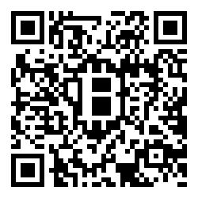

Current status: INCOMPLETE and not very well tested, but usable.

# BitstampPHP

**A PHP API wrapper class and a CLI** for the [Bitstamp REST API v2](https://www.bitstamp.net/api/). Please refer to [their documentation](https://www.bitstamp.net/api/) for calls descriptions.

Basically you can get Bitstamp's current exchange rates, place orders to trade Bitcoins for Euros or United States Dollars, check your open orders, see previous user transactions etc.

## Disclaimer

No guarantee or warranty implied. Use at your own risk. Be careful to set the right parameters expecially when placing orders. Please remember that I will take no responsibility for the integrity or reliability of this library and will not be responsible for any damage or loss of earnings caused by the use of this library.

## Usage

### CLI usage examples

**Get current exchange rates**

    $ ./bitstamp-cli ticker
    +---------+---------+------------+---------+---------+---------------+---------+---------+---------+
    |  HIGH   |  LAST   | TIMESTAMP  |   BID   |  VWAP   |    VOLUME     |   LOW   |   ASK   |  OPEN   |
    +---------+---------+------------+---------+---------+---------------+---------+---------+---------+
    | 3268.59 | 3014.12 | 1506089415 | 3003.81 | 3090.59 | 3117.96511945 | 2968.60 | 3014.12 | 3051.69 |
    +---------+---------+------------+---------+---------+---------------+---------+---------+---------+

**Get EUR/USD conversion rate**

    $ ./bitstamp-cli conversionRate
    +--------+--------+
    |  SELL  |  BUY   |
    +--------+--------+
    | 1.1928 | 1.2060 |
    +--------+--------+

**Place an order to buy 1 BTC at the price of 2900 €**

    $ ./bitstamp-cli buy --amount 1 --price 2900 --currency btceur

### BitstampPHP PHP class usage

Example of usage

```php
$bitstamp = new Mx17\BitstampPHP\BitstampNet($localConfig);

$data = $bitstamp->ticker();
echo print_r($data, 1)."\n";
```

## Install

You need a working PHP environment and [composer](https://getcomposer.org/)

    git clone https://github.com/MaxChinni/BitstampPHP.git
    cd BitstampPHP/
    composer.phar update

## Configure

Create a `config-local.php` with your data; that's for private API calls (which require authentication).

```bash
<?php
$localConfig = array(
    'bitstamp' => array(
        'customerId' => '000000',
        'apiKey' => 'xxxxxxxxxxxxxxxxxxxxxxxxxxxxxxxx',
        'secret' => 'yyyyyyyyyyyyyyyyyyyyyyyyyyyyyyyy',
        'currency' => 'btceur'),
    'proxy' => array(
        'host' => '192.168.0.200',
        'port' => 8080,
        'username' => 'myUsername',
        'password' => 'mySecretPassword')
);
```

## API v2 implementation

call                                      | method
----------------------------------------- | ------------------------------
Ticker                                    | `ticker()`
Hourly ticker                             | `tickerHour()`
Order book                                | `orderBook()`
Transactions                              | `transactions()`
EUR/USD conversion rate                   | `conversionRate()`
Account balance                           | `balance()`
User transactions                         | `userTransactions($offset, $limit, $sort)`
Open orders                               | `openOrders()`
Order status                              | `orderStatus($orderId)`
Cancel order                              | `cancelOrder($orderId)`
Cancel all orders                         | `cancelAllOrders()`
Buy limit order                           | `buy($amount, $price, $limitPrice = null, $dailyOrder = false)`
Buy market order                          | *currently unsupported*
Sell limit order                          | `sell($amount, $price, $limitPrice = null, $dailyOrder = false)`
Sell market order                         | *currently unsupported*
Withdrawal requests                       | *currently unsupported*
Bitcoin withdrawal                        | *currently unsupported*
Litecoin withdrawal                       | *currently unsupported*
Litecoin deposit address                  | *currently unsupported*
ETH withdrawal                            | *currently unsupported*
ETH deposit address                       | *currently unsupported*
Bitcoin deposit address                   | *currently unsupported*
Unconfirmed bitcoin deposits              | *currently unsupported*
Ripple withdrawal                         | *currently unsupported*
Ripple deposit address                    | *currently unsupported*
Transfer balance from Sub to Main account | *currently unsupported*
Transfer balance from Main to Sub Account | *currently unsupported*
XRP withdrawal                            | *currently unsupported*
XRP deposit address                       | *currently unsupported*
Open bank withdrawal                      | *currently unsupported*
Bank withdrawal status                    | *currently unsupported*
Cancel bank withdrawal                    | *currently unsupported*
New liquidation address                   | *currently unsupported*
Liquidation address info                  | *currently unsupported*

# Final

If this project helped you in any way, you can always leave me a tip at (BTC) `1AqoRjfksnh9pmSYM4Uejzd3WJ6Rm8gU13`


# License

The MIT License (MIT)

Copyright (c) 2017 Massimiliano Chinni <bitstampphp@mx17.net>

Permission is hereby granted, free of charge, to any person obtaining a copy of this software and associated documentation files (the "Software"), to deal in the Software without restriction, including without limitation the rights to use, copy, modify, merge, publish, distribute, sublicense, and/or sell copies of the Software, and to permit persons to whom the Software is furnished to do so, subject to the following conditions:

The above copyright notice and this permission notice shall be included in all copies or substantial portions of the Software.

THE SOFTWARE IS PROVIDED "AS IS", WITHOUT WARRANTY OF ANY KIND, EXPRESS OR IMPLIED, INCLUDING BUT NOT LIMITED TO THE WARRANTIES OF MERCHANTABILITY, FITNESS FOR A PARTICULAR PURPOSE AND NONINFRINGEMENT. IN NO EVENT SHALL THE AUTHORS OR COPYRIGHT HOLDERS BE LIABLE FOR ANY CLAIM, DAMAGES OR OTHER LIABILITY, WHETHER IN AN ACTION OF CONTRACT, TORT OR OTHERWISE, ARISING FROM, OUT OF OR IN CONNECTION WITH THE SOFTWARE OR THE USE OR OTHER DEALINGS IN THE SOFTWARE.
